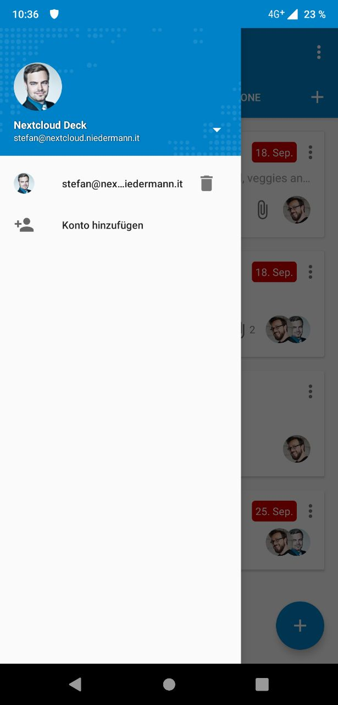

# Account Handling

Given there is a navigation drawer, the top part should display a large image of the current account. Below there should be the display name and below the display name there should be the host of the current account.

To the right of the display name and the host there should be a triangle which switches the content of the drawer to display a list of the available accounts. The last entry should be an option to add a new account.

## Sample

